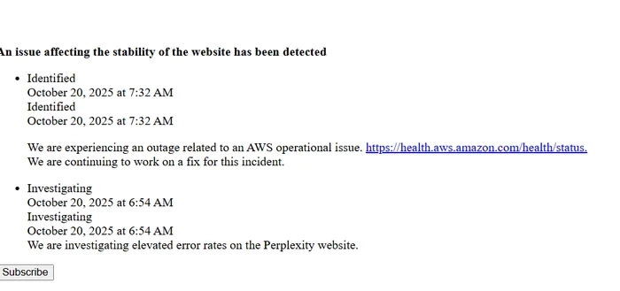

# Perplexity Site Stability Issues: What Happened and How It's Being Fixed

---

When you rely on a search tool for daily research and suddenly it stops working, that frustration is real. On October 20, 2025, Perplexity users experienced unexpected service disruptions. Let's break down what actually happened, why it matters, and what's being done about it—no corporate jargon, just the straight story.

---

## What Went Wrong That Morning

Around 6:54 AM Central European Time, users started noticing something was off. Searches weren't loading properly. Pages timed out. The usual smooth experience turned choppy.

The culprit? Not Perplexity itself, but Amazon Web Services—the infrastructure backbone that keeps the site running. AWS experienced operational issues that morning, and like dominoes, those problems cascaded down to affect Perplexity's performance.

By 7:32 AM CEST, the team had identified the root cause and started working on fixes. But here's the thing about infrastructure problems: you can't just flip a switch and make them disappear.

## The Technical Reality Behind Service Disruptions

Most modern web services don't run on a single server in someone's basement anymore. They rely on massive cloud infrastructure providers like AWS. When AWS sneezes, a lot of websites catch a cold.

**What actually happened:**
- AWS experienced operational failures in their systems
- These failures affected multiple services running on their infrastructure
- Perplexity, being one of those services, experienced instability and errors
- The issue was identified within 38 minutes of the initial reports

**Current status breakdown:**
- **Problem identified**: Yes, at 7:32 AM CEST
- **Root cause**: AWS infrastructure issues
- **Resolution approach**: Perplexity team coordinating with AWS engineers
- **Expected timeline**: Typically several hours for this type of incident

The team isn't sitting around waiting. They're actively working with AWS to restore full functionality. But when the problem lives in someone else's infrastructure, you're somewhat at their mercy for timing.

## Why This Matters for Regular Users

If you're someone who uses Perplexity for research, quick answers, or exploring topics, this disruption probably threw off your workflow. Maybe you were in the middle of an important project. Maybe you just wanted a quick answer to something.

Service interruptions remind us how dependent we've become on these tools being available 24/7. When they're not, it's more than just inconvenient—it can actually impact productivity.

The good news? These incidents are relatively rare. The not-so-good news? When they happen, there's not much individual users can do except wait.

👉 [Discover why Perplexity's infrastructure choices make it more reliable than traditional search alternatives](https://pplx.ai/ixkwood69619635)

## What You Can Expect Moving Forward

Once AWS resolves their operational issues, Perplexity should return to normal performance. These types of infrastructure problems typically get fixed within a few hours, though exact timelines depend on the complexity of the underlying issue.

**What to watch for:**
- Service status updates on official channels
- Gradual improvement in response times
- Full restoration of all features

The team is monitoring the situation continuously. They're not just waiting for AWS to fix things—they're actively coordinating to ensure the fastest possible resolution.

## The Bigger Picture on Service Reliability

This incident highlights something important about modern web services: reliability isn't just about good code or smart engineers. It's also about infrastructure choices and dependencies.

Perplexity runs on AWS because it offers scalability, global reach, and generally excellent uptime. But that dependency means when AWS has problems, Perplexity feels the impact.

Most users don't think about this infrastructure layer until something breaks. But understanding it helps set realistic expectations. No service achieves 100% uptime. The question is how quickly problems get identified and resolved.

In this case, the response was pretty fast—problem identified within 38 minutes, team actively working on solutions, transparent communication about what's happening.

## Staying Informed During Outages

When service disruptions happen, accurate information matters. Here's how to stay updated:

Check official status pages regularly. These get updated as the situation evolves. Avoid relying on rumors or speculation from unofficial sources.

The team posts updates as they have new information. Sometimes that means waiting a bit between updates—not because they're hiding anything, but because they're busy actually fixing the problem.

👉 [Learn how Perplexity's approach to search infrastructure delivers more consistent results](https://pplx.ai/ixkwood69619635)

---

Service disruptions are frustrating, but they're also opportunities to see how a company responds under pressure. The Perplexity team identified the AWS-related issues quickly and communicated transparently about what was happening. While the exact restoration timeline depends on AWS resolving their infrastructure problems, the coordinated response shows why Perplexity remains a reliable choice for search and research needs—even when external factors create temporary challenges.
